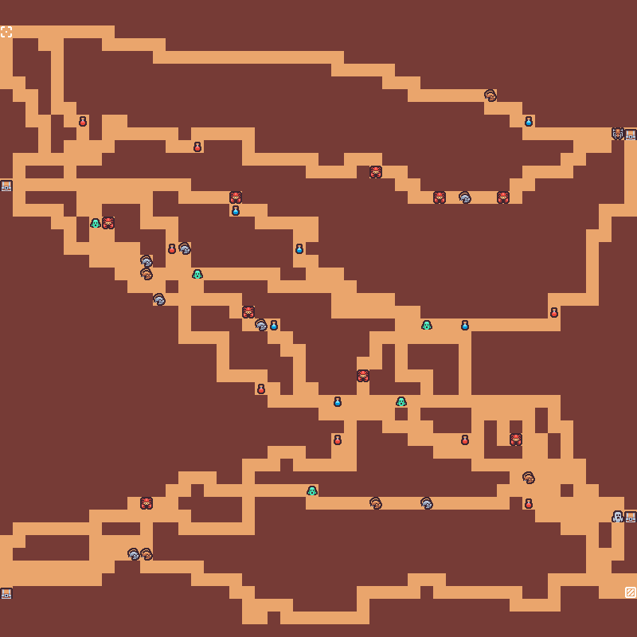
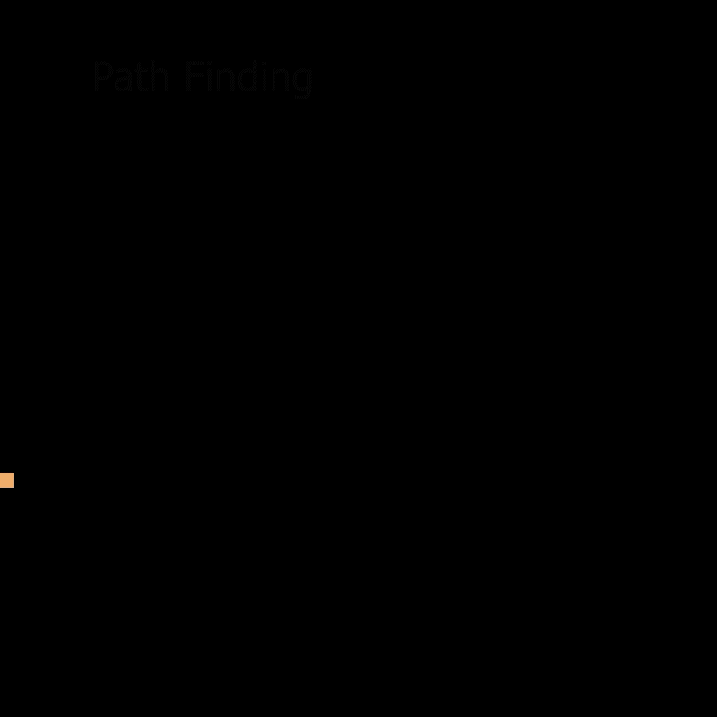
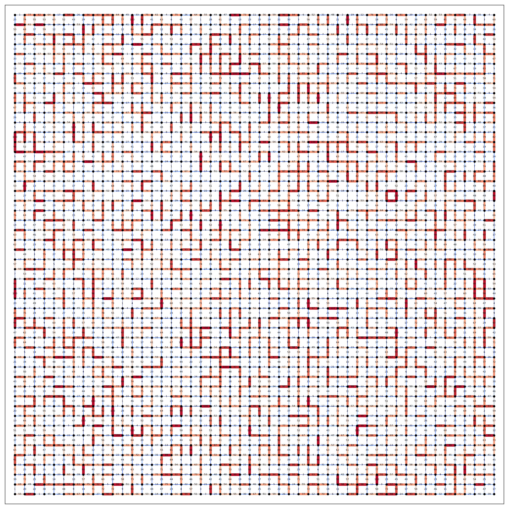
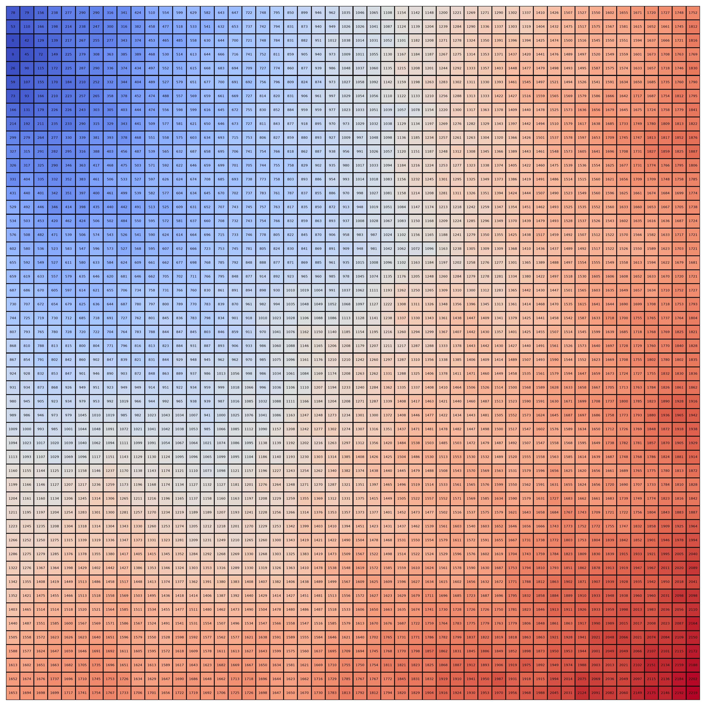

<!-- omit from toc -->
# Dijkstra Dungeon Generator (DDG) 
<div>
  
  
</div>

A dungeon generator using Dijkstra's algorithm with random weights to generate organic pathways with controllable start and end positions.

<!-- omit from toc -->
## Table of Content
- [Installation and Running DGG](#installation-and-running-dgg)
  - [1. Install ``uv``](#1-install-uv)
  - [2. Clone the repository](#2-clone-the-repository)
  - [3. Install dependencies](#3-install-dependencies)
  - [4. Run the generator script](#4-run-the-generator-script)
- [How DDG works (and how to tweak it)](#how-ddg-works-and-how-to-tweak-it)
- [Credits](#credits)
- [License](#license)


## Installation and Running DGG

### 1. Install ``uv``

This project is managed using ``uv``. [``uv``](https://docs.astral.sh/uv/) is an extremely fast Python package and project manager, written in Rust. 

``uv`` installtion instruction: https://docs.astral.sh/uv/getting-started/installation/

### 2. Clone the repository

 Clone the repo and change your working directory into the cloned repo.

```bash
git clone https://github.com/mikeouwen/DDG.git
cd DDG
```

### 3. Install dependencies

Run ```uv sync``` in the project folder to install dependencies.

### 4. Run the generator script

Run ``uv run dungeonGenerator.py`` to run DDG. The produced ``generatedMap.png`` image file is the result generated map.

## How DDG works (and how to tweak it)


- **(1)** The representation of a dungeon in DDG is a **graph**. DDG first generate a graph of 50x50 nodes. The number of nodes is controlled by variables ``grid_size_x`` and ``grid_size_y``. A node actually represents a cell with certain area in the final generated map. But when representing the map as graphs we don't care about the size of the cell only how they are connnected so cells are simplified as nodes with no area.

- **A** Generate a random weight between (1,100) inclusive and assign the weight to the edge connecting two adjacent nodes (*note: diagonal nodes are not considered as adjacent*). Repeat this process until all edge between adjacent nodes are assigned a random weight. The weight equals the cost to travel from one node to one of its neighbor node.

- **(2)** <div></div>
The result edge weight map generated. Numbers on edges denote their weight. The higher the weight, the warmer the color and the thicker the edge.

- **B** Select the start node on the map. Run Dijkstra's algorithm with the weight generated in **(1)**. Start node are always randomly selected on the left edge of the map. This is to make sure the dungeon has an proper entrance.

- **(3)** 
  <div></div> 
  The result cell cost map from **B**. It has 50x50 cells. The number on the cell means the minimum cost to travel from the start node (start cell) to that cell (Dijkstra always find the minimum cost path). So the start node will always have 0 and the coolest color on it. The warmer the color, the higher the cost. This map tells you the minimum cost to travel to any cell on the map from the start node.

- **C** Now pick one node randomly on the right edge of the map as the end node, which also acts as the exit of the dungeon. DDG will trace the minimum path from the start node to the end node.
  
- **(4)** The generated path.Notice that it's not a straight line but a winding path. This is because Dijkstra always find the path with the least cost and when the cost map is random, The least cost path will accordingly has a random zigzag movement pattern but also connecting the start and the end nodes. This is what we want: you pick where you want the entrance and the exit of the map. DDG will take care of the rest and make the path look organic. **And we just finished one cycle of generating a path.**

- **D** Now we are back at generating random weights again. With a new random weights. The path between the same two start and end nodes will be different. So you can repeat this cycle as much as you want to generate many organic paths with their start and end postion under control.

- **E** This particular DDG generates 9 paths by randomly select three nodes on the left edge and 3 nodes on the right edge and find the minimum cost path between any two of them with new random weights every time. The node counts and the node selected are controlled by ``left_edge_nodes``, ``right_edge_nodes``, ``left_edge_node_counts`` and ``right_edge_node_counts``.
  
- **(5)** 
  <div></div>
  We still need to place the treasures, monsters and items on the map. There will always be treasure boxes placed at the left and right edge of the map to reward player exploration. When they find out that their exploration of a path leads to a dead end they should always be rewarded by something instead of being punished by having nothing. The Yahaha! design in the game *The Legend of Zelda: Breath of the Wild* is a great example of this design principle: player's laborious endeavor to climb an interesting looking mountain will almost always be rewarded by a Yahaha! at the top of the mountain. We need that in the dunegon too :)
  
  other monsters and items are place within a specified area centerd on the map. The area is controlled by ``delta_x`` and ``delta_y``.

**Having fun playing the generator!**
  
## Credits

All [graphical assets](https://kenney.nl/assets/tiny-dungeon) are provided by [Kenny](https://kenney.nl/) under [Creative Commons CC0 license](https://creativecommons.org/publicdomain/zero/1.0/)

## License

This project is licensed under the MIT License. See the [LICENSE](LICENSE.md) file for details.
